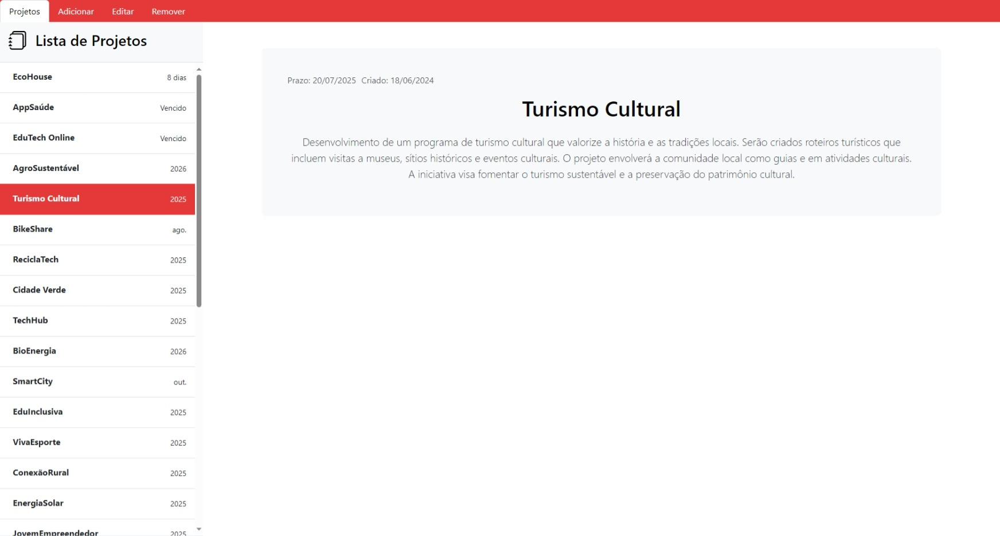

# Gerenciador de Projetos

https://jpfsgs-projetos.netlify.app/

## Descrição
Aplicação Web para criar, editar, remover e gerenciar projetos, com opção de incluir prazo e descrição.

|Desktop|Mobile|
| - | - |
|  |  |

|||
| - | - |
|  |  |

### Darkmode

|||
| - | - |
|  |  |

## Funcionalidades
- Visualizar todos os projetos
- Adicionar novo projeto
- Editar Projeto
- Remover projetos

## Tecnologias Utilizadas

### Backend
- **Linguagem**: Python
- **Framework**: FastAPI
- **Banco de Dados**: SQLite
- **ORM**: SQLAlchemy
- **Hospedagem**: Railway

### Frontend
- **Linguagens**: HTML, CSS, JavaScript
- **Frameworks/Libraries**: Bootstrap, SASS, jQuery
- **Hospedagem**: Netlify

## Endpoints da API

### Projetos
- **GET /projetos**
  - Descrição: Obter todos os projetos

- **POST /projeto/criar**
  - Descrição: Registrar um novo projeto

- **POST /projetos/criar**
  - Descrição: Registrar múltiplos projetos

- **PUT /projeto/editar**
  - Descrição: Alterar um projeto existente

- **DELETE /projeto/deletar**
  - Descrição: Remover um projeto

- **DELETE /projetos/deletar**
  - Descrição: Remover múltiplos projetos